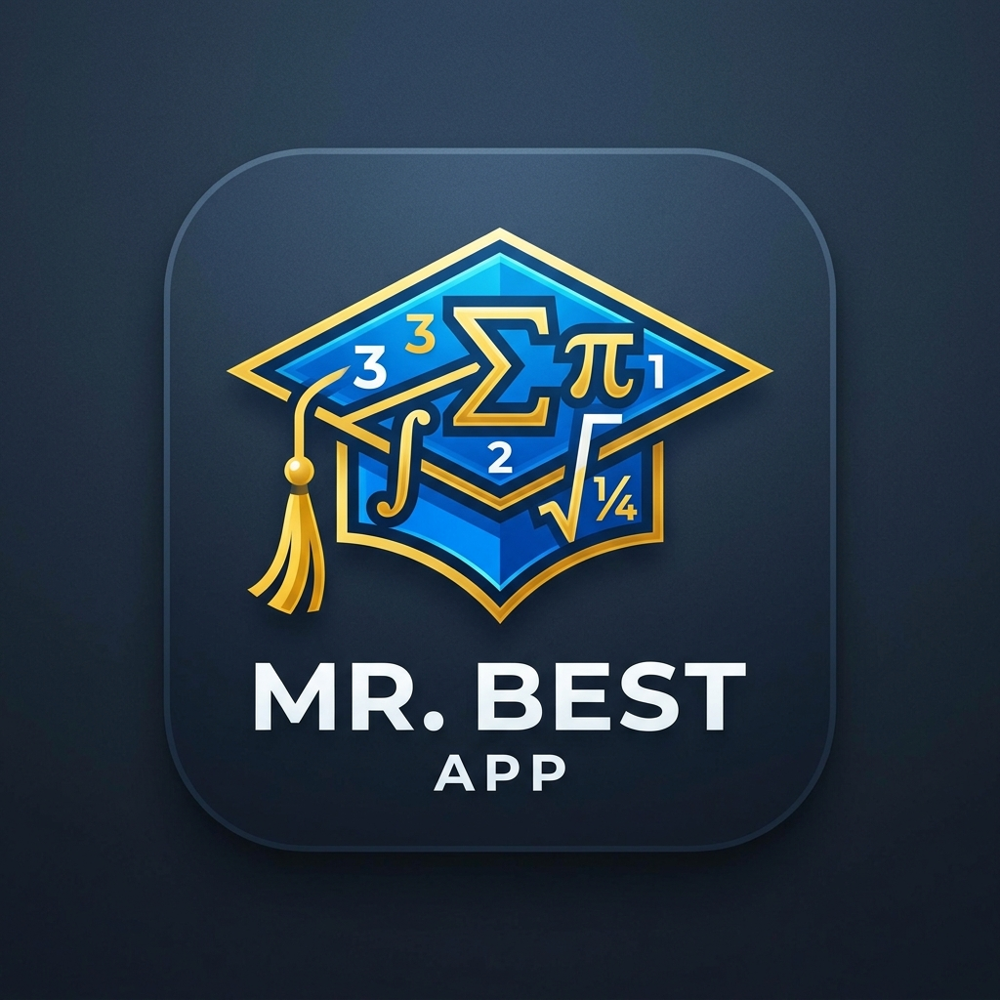

# 🎓 مستر بيست (Mr. Best) - تطبيق إدارة الطلاب والمجموعات والدرجات

<p align="center">
  
</p>

<p align="center">
  <b>نظام شامل واحترافي لإدارة الطلاب والمجموعات الدراسية، رصد الحضور والغياب، متابعة الدرجات والتحصيل العلمي، واستخراج تقارير PDF التفاعلية والمباشرة مع دعم كامل للتصميم المتجاوب (Responsive Design) على كافة الأجهزة (هواتف، أجهزة لوحية، وحواسيب).</b>
</p>

---

## 🚀 المميزات الرئيسية (Key Features)

### 📊 1. لوحة التحكم الإحصائية (Dashboard)
- **إحصائيات فورية**: متابعة إجمالي عدد الطلاب والمجموعات الدراسية وحضور وغياب اليوم (حاضر، متأخر، غائب).
- **أفضل طالب (Best Student)**: إبراز الطالب الأعلى نقاطاً وأداءً على مستوى المركز أو المادة.
- **مؤشر أداء المجموعات**: رسم بياني تفاعلي يوضح متوسط درجات كل مجموعة دراسية.
- **لوحة الأوائل (Leaderboard)**: قائمة ترتيب أفضل 5 طلاب مع عرض النقاط والنسبة المئوية.

### 🌟 الميزات الأساسية (Core Features)
- **إدارة المجموعات والطلاب**: إضافة، تعديل، وحذف الطلاب والمجموعات بسهولة مع دعم استيراد الصور وتحديد المدارس.
- **تسجيل الحضور والغياب السريع**: تسجيل الحضور بضغطة زر مع حساب تلقائي لنسب الالتزام لكل طالب.
- **رصد وتقييم الدرجات**: نظام متكامل لتسجيل درجات الاختبارات، الواجبات، والتقييمات الأسبوعية/الشهرية.
- **تقارير PDF احترافية (تعمل 100% Offline)**: استخراج كشوفات أداء فردية وجماعية بتنسيق PDF ومشاركتها مباشرة مع أولياء الأمور (بدعم كامل للغة العربية محلياً).
- **واجهة عصرية وفاخرة (Premium UI)**: تصميم متجاوب (Responsive) يعمل بسلاسة على الهواتف، الأجهزة اللوحية، وشاشات العرض مع دعم كامل للوضع الليلي (Dark Mode) بألوان حديثة ومريحة للعين.
- **دعم كامل للغة العربية (RTL)**: واجهة مستخدم مبنية بالكامل لتتوافق مع اتجاه اللغة العربية.

### 📝 4. رصد الحضور والغياب (Attendance Tracking)
- إنشاء جلسات حضور بتاريخ وعنوان الجلسة.
- رصد سريع وحركي لحالة كل طالب (حاضر / متأخر / غائب).
- التحديث الفوري لإحصائيات ونسب التزام الطلاب.

### 💯 5. رصد الدرجات والتقييمات (Grades Management)
- دعم أنواع متعددة من التقييمات: (الامتحان الشهري، التقييم الأسبوعي، اختبار الدرس، الواجبات، امتحان نصف الترم، درجات المدرسة).
- حساب النسبة المئوية والنقاط المستحقة تلقائياً.

### 📄 6. معاينة وتصدير تقارير PDF المباشرة (Live PDF Preview & Share)
- **شاشة معاينة تفاعلية (PdfPreviewScreen)**: استعراض تقارير PDF بدقة عالية قبل المشاركة مع إمكانية التكبير والتصغير والطباعة المباشرة.
- **مشاركة سريعة عبر واتساب والتطبيقات**: مشاركة تقرير الأداء الفردي للطالب أو كشف المجموعة بنقرة زر واحدة عبر خيارات المشاركة في النظام.

### 📱 7. تصميم متجاوب وأنيق (Responsive UI/UX)
- **دعم كافة الشاشات**: يتكيف التطبيق تلقائياً مع الهواتف الذكية والأجهزة اللوحية (Tablets) وأجهزة الديسك توب.
- **شريط navigation ذكي**: يتحول من NavigationBar سفلي في الهواتف إلى NavigationRail جانبي متكامل في الشاشات العريضة.
- **شبكات بطاقات مرنة**: إعادة توزيع بطاقات الإحصائيات والمجموعات والطلاب في شبكات (Grid Systems) تتكيف مع مساحة الشاشة.

---

## 🛠️ البناء والتطوير (Tech Stack & Architecture)

- **الإطار البرمجي**: [Flutter](https://flutter.dev) (Dart 3.x)
- **إدارة الحالة**: [Flutter Riverpod](https://riverpod.dev)
- **قاعدة البيانات المحلية**: [SQLite (`sqflite`)](https://pub.dev/packages/sqflite)
- **التوجيه والتنقل**: [GoRouter](https://pub.dev/packages/go_router)
- **إنشاء وتصوير ملفات PDF**: [pdf](https://pub.dev/packages/pdf) & [printing](https://pub.dev/packages/printing)
- **المشاركة والأدوات**: [share_plus](https://pub.dev/packages/share_plus), [path_provider](https://pub.dev/packages/path_provider)

---

## 📂 هيكل المشروع (Project Structure)

```text
lib/
├── core/
│   ├── database/       # DatabaseHelper وربط الجداول وإجراء الاستعلامات
│   ├── router/         # مسارات التطبيق عبر GoRouter
│   ├── theme/          # الألوان والثيمات (Light/Dark Mode)
│   └── utils/          # responsive_layout.dart و pdf_generator.dart
└── features/
    ├── attendance/     # منطق وشاشات رصد الحضور والغياب
    ├── dashboard/      # لوحة التحكم الرئيسية والرسوم البيانية
    ├── grades/         # إدارة ورصد التقييمات والدرجات
    ├── groups/         # إدارة المجموعات والكشوف
    ├── navigation/     # التصفح المتجاوب (MainNavigationWrapper)
    ├── pdf/            # شاشة معاينة وتصدير PDF المباشرة (PdfPreviewScreen)
    ├── settings/       # الإعدادات وتبديل الثيم
    └── students/       # إدارة الطلاب والملف الشخصي والبحث
```

---

## ⚙️ التشغيل والتثبيت (Getting Started)

1. **تأكد من تثبيت بيئة Flutter**:
   ```bash
   flutter doctor
   ```

2. **تحميل التبعيات والمكتبات**:
   ```bash
   flutter pub get
   ```

3. **تشغيل التطبيق**:
   ```bash
   flutter run
   ```

---

<p align="center">
  تم التطوير بحب وشغف لتوفير تجربة تعليمية وإدارية فريدة وسريعة 🚀
</p>
